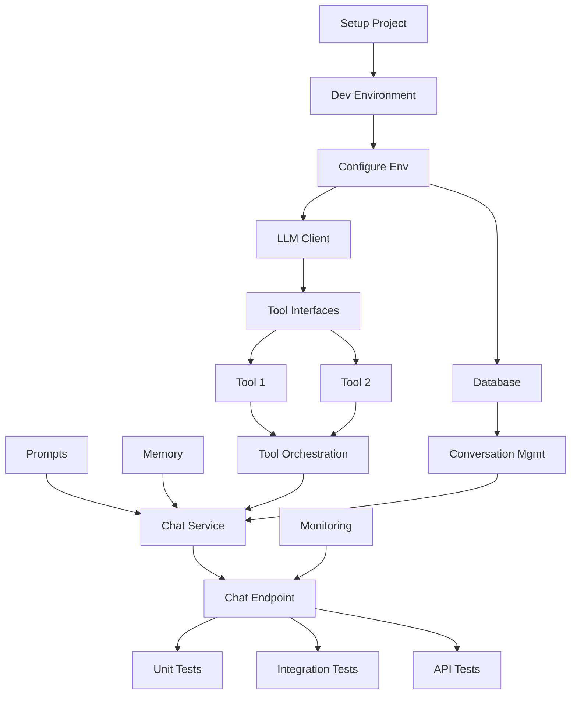

# Create Development Plan Skill

## Description
Create a detailed, actionable development plan for implementing an AI agent project using the agent-api-cookiecutter template. This skill converts requirements (from a PRD or direct input) into a step-by-step implementation roadmap.

## Usage
```
@create-plan [optional: reference to PRD or project context]
```

## What This Skill Does
1. Analyzes project requirements and architecture
2. Creates a prioritized, phased implementation plan
3. Breaks down work into manageable tasks
4. Identifies dependencies and critical path
5. Provides effort estimates and milestones
6. Maps tasks to the cookiecutter template structure

## Workflow

### Step 1: Requirements Analysis

Review or gather:
- Project requirements (from PRD or user input)
- Technical constraints
- Team capacity and timeline
- Dependencies and risks

Use `AskUserQuestion` if information is missing:
- "What's your target completion date?"
- "How many developers will work on this?"
- "What's your team's experience level with agents/LLMs?"
- "Are there any hard deadlines or milestones?"

### Step 2: Architecture Planning

Map requirements to the three-layer architecture:

**Domain Layer Tasks:**
- [ ] Define tool interfaces and schemas
- [ ] Create prompt templates
- [ ] Design memory models
- [ ] Implement domain exceptions
- [ ] Create utility functions

**Application Layer Tasks:**
- [ ] Implement chat service
- [ ] Build tool orchestration
- [ ] Add memory management
- [ ] Create evaluation service
- [ ] Implement document ingestion (if needed)

**Infrastructure Layer Tasks:**
- [ ] Configure LLM provider clients
- [ ] Set up database connections
- [ ] Create API endpoints
- [ ] Add authentication/authorization
- [ ] Implement monitoring and logging

### Step 3: Task Breakdown

For each major component, create detailed task cards:

```markdown
### Task: [Task ID] - [Task Name]

**Priority:** High/Medium/Low
**Effort:** [Hours/Days]
**Dependencies:** [Task IDs this depends on]
**Layer:** Domain/Application/Infrastructure
**Assignee:** [Team member or TBD]

**Description:**
[Detailed description of what needs to be done]

**Acceptance Criteria:**
- [ ] Criterion 1
- [ ] Criterion 2
- [ ] Criterion 3

**Implementation Steps:**
1. Step 1
2. Step 2
3. Step 3

**Files to Create/Modify:**
- `src/{project}/domain/tools/tool_name.py`
- `src/{project}/application/chat_service/__init__.py`
- `tests/test_tool_name.py`

**Testing Requirements:**
- Unit tests for tool functions
- Integration tests for service
- API endpoint tests

**Definition of Done:**
- [ ] Code implemented and reviewed
- [ ] Tests written and passing
- [ ] Documentation updated
- [ ] Code merged to main branch
```

### Step 4: Phase Planning

Organize tasks into logical phases:

#### Phase 0: Project Setup (Week 1)
**Goal:** Get the project structure in place and environment configured

**Tasks:**
- **SETUP-001**: Run cookiecutter to generate project (1 hour)
  - Files: Project structure
  - Owner: Tech Lead
  
- **SETUP-002**: Set up development environment (2 hours)
  - Install dependencies
  - Configure IDE/editor
  - Set up pre-commit hooks
  
- **SETUP-003**: Configure environment variables (1 hour)
  - Create `.env` file
  - Add API keys
  - Configure database URLs
  
- **SETUP-004**: Verify base template functionality (1 hour)
  - Run existing tests
  - Start development server
  - Test API docs endpoint

**Milestone:** Development environment ready
**Success Criteria:** Team can run the application locally

---

#### Phase 1: Core Infrastructure (Weeks 2-3)
**Goal:** Set up foundational infrastructure components

**Tasks:**
- **INFRA-001**: Configure LLM provider client (4 hours)
  - File: `src/{project}/infrastructure/llm_providers/openai_client.py`
  - Implement chat completion
  - Add error handling and retries
  - Test with sample prompts
  
- **INFRA-002**: Set up database models and migrations (6 hours)
  - File: `src/{project}/infrastructure/db/models.py`
  - Define conversation history schema
  - Create migration scripts
  - Test CRUD operations
  
- **INFRA-003**: Implement basic logging and monitoring (3 hours)
  - File: `src/{project}/infrastructure/monitoring/logger.py`
  - Configure structured logging
  - Add request ID tracking
  - Set up log aggregation

- **INFRA-004**: Create health check endpoints (2 hours)
  - File: `src/{project}/infrastructure/api/main.py`
  - Add `/health` endpoint
  - Check database connection
  - Check LLM provider availability

**Milestone:** Infrastructure ready for agent development
**Success Criteria:** All external services connected and monitored

---

#### Phase 2: Domain Layer (Weeks 3-4)
**Goal:** Implement core business logic and tools

**Tasks:**
- **DOMAIN-001**: Define tool interfaces (3 hours)
  - File: `src/{project}/domain/tools/__init__.py`
  - Create base tool interface
  - Define tool registry
  - Add tool validation
  
- **DOMAIN-002**: Implement [Tool 1 Name] (6 hours)
  - File: `src/{project}/domain/tools/tool1.py`
  - Implement tool logic
  - Create LLM schema
  - Add error handling
  - Write unit tests
  
- **DOMAIN-003**: Implement [Tool 2 Name] (6 hours)
  - File: `src/{project}/domain/tools/tool2.py`
  - [Similar breakdown as above]
  
- **DOMAIN-004**: Create prompt templates (4 hours)
  - File: `src/{project}/domain/prompts/system_prompt.py`
  - Write system prompt
  - Create few-shot examples
  - Add prompt versioning
  
- **DOMAIN-005**: Design memory models (5 hours)
  - File: `src/{project}/domain/memory/conversation_memory.py`
  - Define memory interface
  - Implement sliding window
  - Add summarization logic

**Milestone:** Domain logic complete
**Success Criteria:** All tools work independently with proper tests

---

#### Phase 3: Application Layer (Weeks 5-6)
**Goal:** Orchestrate components into services

**Tasks:**
- **APP-001**: Implement chat service (8 hours)
  - File: `src/{project}/application/chat_service/__init__.py`
  - Integrate LLM client
  - Add tool calling logic
  - Implement memory management
  - Handle streaming responses
  
- **APP-002**: Implement tool orchestration (6 hours)
  - File: `src/{project}/application/chat_service/tool_executor.py`
  - Execute tool calls
  - Handle tool errors
  - Format tool results
  - Add retry logic
  
- **APP-003**: Add conversation management (5 hours)
  - File: `src/{project}/application/chat_service/conversation.py`
  - Load conversation history
  - Update history
  - Manage context window
  - Implement summarization
  
- **APP-004**: Implement evaluation service (Optional, 6 hours)
  - File: `src/{project}/application/evaluation_service/__init__.py`
  - Define evaluation metrics
  - Create test cases
  - Generate evaluation reports

**Milestone:** Core services operational
**Success Criteria:** End-to-end conversation flow works

---

#### Phase 4: API Layer (Week 7)
**Goal:** Expose services through REST API

**Tasks:**
- **API-001**: Implement chat endpoint (4 hours)
  - File: `src/{project}/infrastructure/api/main.py`
  - Create request/response models
  - Add validation
  - Handle errors
  - Add streaming support (if needed)
  
- **API-002**: Add conversation history endpoints (3 hours)
  - GET /conversations/{id}
  - DELETE /conversations/{id}
  - GET /conversations (list)
  
- **API-003**: Implement authentication (6 hours)
  - File: `src/{project}/infrastructure/api/auth.py`
  - Choose auth method (API key, JWT, OAuth)
  - Implement middleware
  - Add rate limiting
  
- **API-004**: Add API documentation (2 hours)
  - Enhance FastAPI docs
  - Add examples
  - Document error codes

**Milestone:** API ready for testing
**Success Criteria:** All endpoints documented and working

---

#### Phase 5: Testing & Quality (Week 8)
**Goal:** Comprehensive testing and quality assurance

**Tasks:**
- **TEST-001**: Unit tests for tools (6 hours)
  - File: `tests/domain/test_tools.py`
  - Test each tool function
  - Test error cases
  - Mock external dependencies
  
- **TEST-002**: Integration tests for services (8 hours)
  - File: `tests/application/test_chat_service.py`
  - Test full conversation flows
  - Test tool orchestration
  - Test memory management
  
- **TEST-003**: API endpoint tests (6 hours)
  - File: `tests/infrastructure/test_api.py`
  - Test all endpoints
  - Test authentication
  - Test error responses
  
- **TEST-004**: End-to-end tests (6 hours)
  - File: `tests/test_e2e.py`
  - Test complete user journeys
  - Test edge cases
  - Performance testing
  
- **TEST-005**: Code quality checks (3 hours)
  - Run linters (ruff)
  - Check code coverage (>80%)
  - Fix any issues

**Milestone:** Quality gates passed
**Success Criteria:** All tests passing, coverage >80%

---

#### Phase 6: Documentation & Deployment (Week 9)
**Goal:** Prepare for production deployment

**Tasks:**
- **DOC-001**: Update README (3 hours)
  - File: `README.md`
  - Add project-specific details
  - Document setup process
  - Add usage examples
  
- **DOC-002**: Create API documentation (4 hours)
  - Export OpenAPI spec
  - Create Postman collection
  - Write API guide
  
- **DOC-003**: Write deployment guide (4 hours)
  - Document deployment steps
  - Add environment configuration
  - Include troubleshooting
  
- **DEPLOY-001**: Set up Docker configuration (3 hours)
  - Verify Dockerfile
  - Update docker-compose.yaml
  - Test local Docker deployment
  
- **DEPLOY-002**: Configure CI/CD pipeline (6 hours)
  - Set up GitHub Actions
  - Add test automation
  - Configure deployment
  
- **DEPLOY-003**: Deploy to staging (4 hours)
  - Deploy application
  - Configure environment
  - Run smoke tests
  
- **DEPLOY-004**: Monitor and optimize (Ongoing)
  - Set up monitoring dashboards
  - Configure alerts
  - Performance tuning

**Milestone:** Production-ready
**Success Criteria:** Application deployed and monitored

---

### Step 5: Dependency Graph

Create a visual dependency graph:



### Step 6: Risk Management Plan

For each phase, identify risks:

```markdown
### Phase 2 Risks

**RISK-P2-001: Tool integration complexity**
- **Impact:** High - Could delay Phase 2
- **Probability:** Medium
- **Mitigation:** Start with simplest tool, build complexity gradually
- **Contingency:** Reduce tool scope for MVP

**RISK-P2-002: Prompt engineering challenges**
- **Impact:** Medium - Affects agent quality
- **Probability:** High
- **Mitigation:** Allocate time for iteration, use few-shot examples
- **Contingency:** Use simpler prompts, enhance gradually
```

### Step 7: Resource Allocation

Create a resource plan:

```markdown
## Team Structure

### Role: Tech Lead
**Responsibilities:**
- Architecture decisions
- Code reviews
- SETUP and INFRA tasks
**Time Allocation:** 50% (20 hours/week)

### Role: Backend Developer 1
**Responsibilities:**
- Domain layer implementation
- Tool development
**Time Allocation:** 100% (40 hours/week)
- Phase 2: DOMAIN-001 through DOMAIN-003
- Phase 3: APP-001, APP-002

### Role: Backend Developer 2
**Responsibilities:**
- Application layer
- API layer
**Time Allocation:** 100% (40 hours/week)
- Phase 2: DOMAIN-004, DOMAIN-005
- Phase 3: APP-003
- Phase 4: All API tasks

### Role: QA Engineer
**Responsibilities:**
- Test development
- Quality assurance
**Time Allocation:** 75% (30 hours/week)
- Phase 5: All TEST tasks
- Ongoing: Test automation
```

### Step 8: Progress Tracking

Set up tracking mechanisms:

```markdown
## Progress Metrics

### Velocity Tracking
- Story points per week
- Burndown chart
- Planned vs. actual completion

### Quality Metrics
- Code coverage percentage
- Number of bugs found/fixed
- Test pass rate
- Code review turnaround time

### Status Reports
- Daily standups: What's done, what's next, blockers
- Weekly: Progress against milestones
- Bi-weekly: Demo to stakeholders
```

## Plan Document Structure

```markdown
# Development Plan: [Project Name]

## Overview
- **Project:** [Name]
- **Duration:** [Weeks]
- **Team Size:** [Number]
- **Start Date:** [Date]
- **Target Launch:** [Date]

## Objectives
1. Objective 1
2. Objective 2

## Architecture Overview
[Brief description of three-layer architecture and key components]

## Implementation Phases

### Phase 0: Setup
[Details as shown above]

### Phase 1: Core Infrastructure
[Details as shown above]

[... continue for all phases ...]

## Task List

### High Priority (Must Have for MVP)
- [ ] SETUP-001: Run cookiecutter
- [ ] INFRA-001: Configure LLM client
- [ ] DOMAIN-002: Implement core tool
[... etc ...]

### Medium Priority (Should Have)
[Tasks list]

### Low Priority (Nice to Have)
[Tasks list]

## Dependencies
[Dependency graph and explanation]

## Timeline
[Gantt chart or timeline visualization]

## Resource Allocation
[Team structure and assignments]

## Risk Management
[Identified risks and mitigation strategies]

## Success Criteria
[What success looks like for the project]

## Monitoring & Reporting
[How progress will be tracked and reported]

## Appendix

### A: File Structure Mapping
Maps each task to specific files in the cookiecutter structure

### B: Testing Strategy
Comprehensive testing approach

### C: Deployment Strategy
Deployment approach and environments
```

## Output Files

Generate these files in a `planning/` directory:

1. **development-plan.md** - Main implementation plan
2. **task-breakdown.md** - Detailed task cards
3. **timeline.md** - Gantt chart or timeline
4. **resource-plan.md** - Resource allocation
5. **risk-register.md** - Risk tracking
6. **definition-of-done.md** - Checklist for task completion

## Example Interaction

**User:** "@create-plan for customer support agent with ticket integration"

**Claude Response:**

I'll create a development plan for your customer support agent. Let me gather some information first.

**Questions:**
1. How many developers will work on this? (e.g., 2-3)
2. What's your target timeline? (e.g., 8-10 weeks)
3. Team's experience level with LLM agents? (Beginner/Intermediate/Advanced)
4. Any hard deadlines or demos scheduled?
5. Which tools are must-have vs. nice-to-have?

[After gathering responses]

Based on your answers, I've created a comprehensive development plan:

**Project:** SmartSupport Agent
**Duration:** 9 weeks
**Team:** 2 backend developers + 1 QA engineer
**MVP Date:** Week 6
**Production Launch:** Week 9

[Provides complete plan with all phases, tasks, dependencies, and timeline]

## Integration with Other Skills

**Workflow:**
1. **@init-project** - Gather basic project info
2. **@generate-prd** - Create detailed requirements
3. **@create-plan** - Develop implementation plan ← This skill
4. **Implementation** - Execute the plan
5. **Monitoring** - Track progress and adapt

## Best Practices

1. **Start Small:** MVP first, then enhance
2. **Clear Dependencies:** Make dependencies explicit
3. **Realistic Estimates:** Add buffer for unknowns (×1.5)
4. **Regular Checkpoints:** Demo every 2 weeks
5. **Adapt:** Review and adjust plan weekly
6. **Document Decisions:** Record architectural decisions
7. **Celebrate Wins:** Acknowledge milestone completion

## Estimation Guidelines

### Task Sizing
- **Small (2-4 hours):** Single function, simple logic
- **Medium (4-8 hours):** Service component, moderate complexity
- **Large (1-2 days):** Major feature, multiple components
- **X-Large (3+ days):** Complex integration, break down further

### Common Task Estimates
- Simple tool implementation: 4-6 hours
- Complex tool with external API: 8-12 hours
- Service layer component: 6-10 hours
- API endpoint with tests: 3-5 hours
- Database schema and migrations: 4-6 hours
- LLM provider integration: 6-8 hours
- Authentication setup: 8-12 hours
- Comprehensive documentation: 4-6 hours

## Adaptation Strategies

### If Behind Schedule:
1. Re-prioritize: Move nice-to-haves to Phase 2
2. Simplify: Reduce scope of complex features
3. Parallelize: Add resources where possible
4. Cut: Eliminate lowest-value features

### If Ahead of Schedule:
1. Add polish: Improve UX and error handling
2. Add features: Implement nice-to-haves
3. Improve quality: Increase test coverage
4. Document better: Enhance documentation

### If Scope Changes:
1. Assess impact on timeline
2. Re-prioritize tasks
3. Update stakeholders
4. Revise plan and estimates
